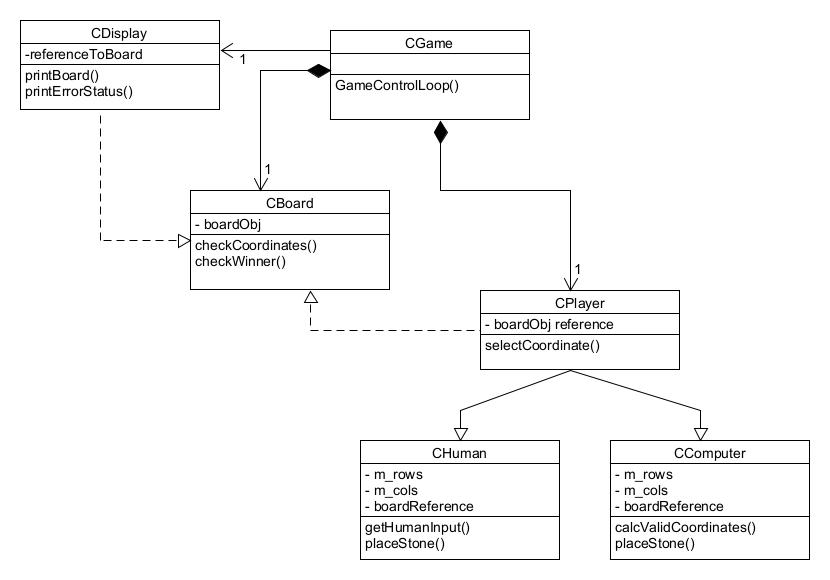
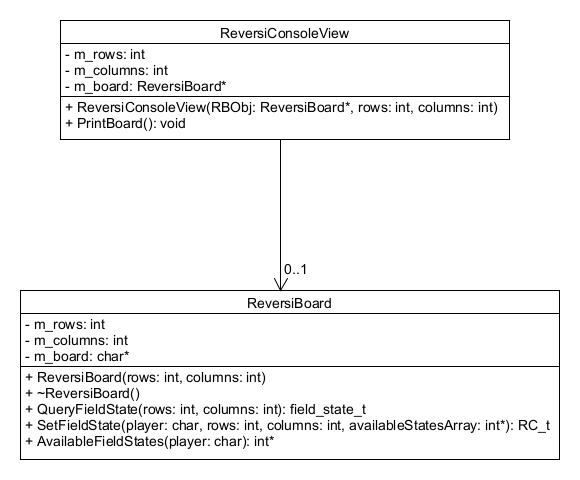
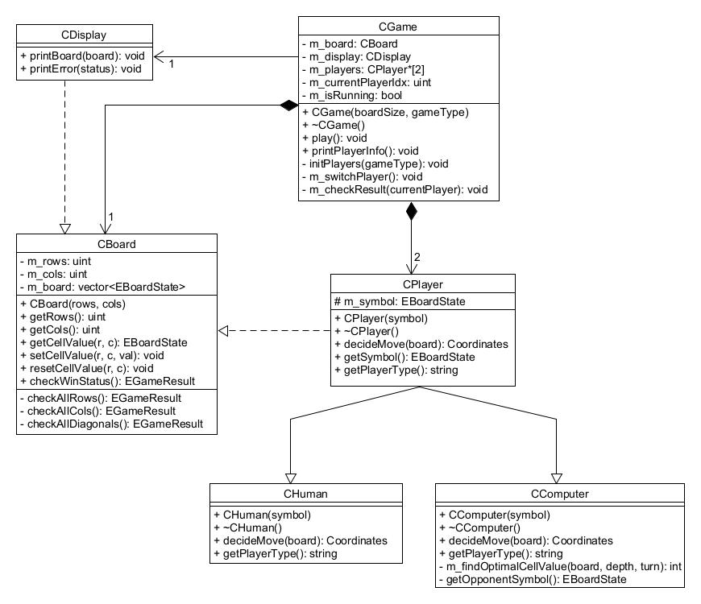

# TicTacToe

Learning focus:
Class Design, Class Diagrams, Activity Diagrams, Code Reuse, Static and Dynamic Polymorphism.

The task is to develop an object oriented version of the game TicTacToe.

## 1 Class Relations

### 1.1 Requirements

The task is to develop a console based version of the board game TicTacToe

- The game consists of a 3x3/4x4/5x5 board.
- On every position, the players place a “x” (player 1) or a “o” (Player 2) stone.
- The first player, who has 3 stones in a row (horizontally, vertically or diagonally) wins the game.

Technical requirements

- Player 1 and 2 can either be human or computer, i.e.

    1. Human against Computer
    2. Human against human
    3. Computer against human
    4. Computer against computer are possible combinations.
    
- The computer may never loose.
- The board will be displayed as a console application.
- Displaying the screen later on in a graphical format shall be easily supported.
- Provide DoxyGen Style comments for all entities and create a website for your project.

### 1.2 OO Analysis

From the requirements, identify the mentioned objects and describe them using the concept of OOA (object oriented analysis)

| Object    | Properties | Capabilities |
|:---------:|:----------:|:------------:|
| CGame     | has one board (Composition), has two players (Composition), knows CDisplay (Association) | It controls the game, runs the loop for the game. Gets coordinates from CPlayer -> validate pos -> update board -> if error, inform CDisplay |
| CBoard    | creates 3x3 board | checks the coordinates, checks for winner |
| CDisplay  | needs reference of the board | prints the board, prints ErrorCode |
| CPlayer   | uses CBoard | selectCoordinate |
| CHuman    | inherits CPlayer | getInput(), placesStone |
| CComputer | inherits CPlayer | calcValidPos(), placesStone |
| CErrorStatus | helper class  | Enum with error codes required |

### 1.3 OO Design

Create a first rough class design based on the results of the object oriented analysis. Methods and attributes can be ommitted.



### 1.4 Reuse

Check the implementation of the Reversi Boardgrame and describe which classes can be reused. Provide a class diagram for every class you reuse and describe if changes are required.



| Class    | Required Modifications |
|:---------:|:----------:|
| ReversiBoard    | QueryFieldState() can be reused |  
| ReversiConsoleView    | printBoard() can be reused |


### 1.5 Static Polymorphism

Draw a class diagram for a possible implementation of the TicTacToe boardgame using static polymorphism for the Screen and Player partition.

<to be drawn later>

### 1.6 Dynamic Polymorphism

The disadvantage of the static design is the missing flexibility of choosing computer / human players. Use dynamic polymorphism for both the screen and the players to support a code structure like the one below. Note, that inside the loop, we do not care if the player is a human or a computer, nor, what type of screen we have connected.

```
void CTicTacToe::play()
{
    selectPlayer(0);
    selectPlayer(1);
    for (unsigned short i = 0; i < 9; i++)
    {
        cout << "Placing a stone in round " << i+1 << endl;
        bool finished = m_player[i%2]->placeStone();
        m_screen->print();
        if (finished)
        {
            cout << "We have a winner!!!" << endl;
            return; //hacky break
        }
    }
    cout << "Draw...." << endl;
}
```

Draw the corresponding class diagram.

<to be drawn later>


## 2 Algorithms and Design Decisions

### 2.1 Activity Diagram

Draw an activity diagram describing the top level placeStone-Strategy for the computer player.

<to be drawn>

### 2.2 Spooky Hierarchy

After spending a frustratingly large number of hours for creating the first design, you decide to hack the notebook from Nelly, the Nerd to check for his solution. You find the following design snippet:

<add the class diagram as image or draw it>

Explain the following programming concepts (check with cplusplus.com or use a good textbook)

Friend Class:

Static Attribute:

Static Method:

Throwing and Catching Exceptions:

Using these concepts, describe how you can implement the following feature:

    - A CPosition object describes a specific position on the boardgame.
    - The CPosition Object knows the size of the board (number of rows and columns).
    - The size attribute may only be set by the CBoard class, while the board is being constructed.
    - If a CPosition object is constructed, whose value is out of the range of the board, the user will be informed so that he can initiate a proper error handling.

## 3 Implementation and Test

### 3.1 Final UML Design of the Game



### 3.2 Output of the game

```
TicTacToe started.

Choose the Game Type from below options: 
1. Human vs Human
2. Human vs Computer
3. Computer vs Computer
3
Enter TicTacToe Board Size (3, 4, or 5): 3

----------- Game Configuration -----------

Type: Computer vs Computer

Grid: 3x3

Player-0: Computer (o)

Player-1: Computer (x)
---------------------------------------

. . . 
. . . 
. . . 

Player-1 x (Computer) turn:

x . . 
. . . 
. . . 

Player-0 o (Computer) turn:

x . . 
. o . 
. . . 

Player-1 x (Computer) turn:

x x . 
. o . 
. . . 

Player-0 o (Computer) turn:

x x o 
. o . 
. . . 

Player-1 x (Computer) turn:

x x o 
. o . 
x . . 

Player-0 o (Computer) turn:

x x o 
o o . 
x . . 

Player-1 x (Computer) turn:

x x o 
o o x 
x . . 

Player-0 o (Computer) turn:

x x o 
o o x 
x o . 

Player-1 x (Computer) turn:

x x o 
o o x 
x o x 

Unfortunately it is a draw!!!

Game Ended!!!
```