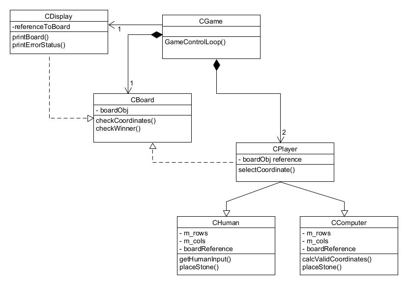
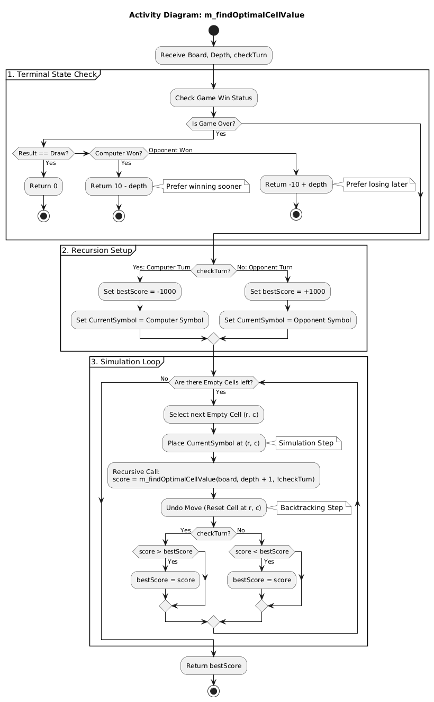
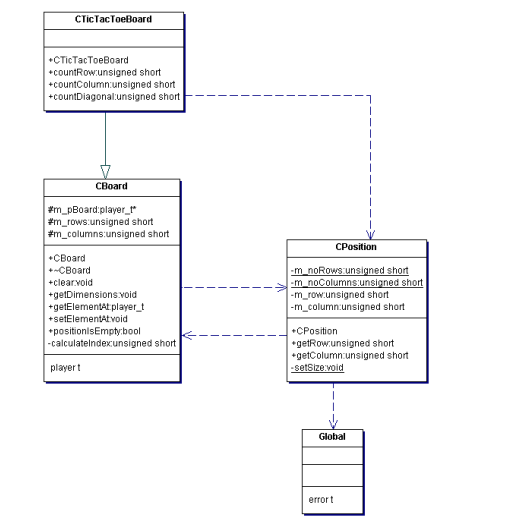

# 📘 TicTacToe: Architecture & Design Report

**Learning Focus:** Class Design, Class Diagrams, Activity Diagrams, Code Reuse, Static and Dynamic Polymorphism.

---

## 1. Class Relations

### 1.1 Requirements
The goal is to develop an object-oriented console version of TicTacToe that supports:
- Dynamic board sizes (3x3, 4x4, 5x5).
- Flexible players (Human vs Computer, CvC, HvH).
- An invincible computer opponent.
- Future-proof design for graphical interfaces.

### 1.2 OO Analysis (OOA)
Identifying objects from requirements:

| Object | Properties | Capabilities |
| :--- | :--- | :--- |
| **CGame** | Composed of 1 Board, 2 Players. Knows CDisplay. | Controls game loop. Validates moves via Player input, updates Board, triggers Display. |
| **CBoard** | Stores grid data (Rows x Cols). | Validates coordinates, checks win conditions (Rows, Cols, Diagonals). |
| **CDisplay** | References the Board. | Prints the grid, prints Error Codes. |
| **CPlayer** | Abstract Base Class. | `decideMove()` (Virtual). |
| **CHuman** | Inherits CPlayer. | Gets input via Console/UI. |
| **CComputer**| Inherits CPlayer. | Calculates position via Random/Minimax. |
| **CError** | Helper Class. | Enum with error codes. |

### 1.3 OO Design
Initial rough class design:



### 1.4 Reuse
Analysis of the Reversi Boardgame for potential reuse:


| Class | Required Modifications |
| :--- | :--- |
| **ReversiBoard** | `QueryFieldState()` logic is reusable, but win condition logic differs significantly. |
| **ReversiConsoleView** | `printBoard()` structure is reusable, but symbols (X/O vs Black/White) differ. |

### 1.5 Static Polymorphism
*Class diagram for TicTacToe using Template-based Static Polymorphism.*

*(Insert your Static Polymorphism UML Diagram here)*

### 1.6 Dynamic Polymorphism
The disadvantage of the static design is the missing flexibility of choosing computer / human players. Use dynamic polymorphism for both the screen and the players to support a code structure like the one below. Note, that inside the loop, we do not care if the player is a human or a computer, nor, what type of screen we have connected.

```
void CTicTacToe::play()
{
    selectPlayer(0);
    selectPlayer(1);
    for (unsigned short i = 0; i < 9; i++)
    {
        cout << "Placing a stone in round " << i+1 << endl;
        bool finished = m_player[i%2]->placeStone();
        m_screen->print();
        if (finished)
        {
            cout << "We have a winner!!!" << endl;
            return; //hacky break
        }
    }
    cout << "Draw...." << endl;
}
```

*(Insert your Dynamic Polymorphism UML Diagram here)*

-----

## 2\. Algorithms and Design Decisions

### 2.1 Activity Diagram (Computer Strategy)

Top-level strategy for `placeStone` (Minimax/Random logic):



### 2.2 Advanced C++ Concepts ("Spooky Hierarchy")

After spending a frustratingly large number of hours for creating the first design, you decide to hack the notebook from Nelly, the Nerd to check for his solution. You find the following design snippet:



### 2.3 Concepts Defined

#### Friend Class

A **Friend Class** is a class that is granted special access to the **private** and **protected** members of another class. Under normal object-oriented rules, private data is hidden from outside classes. However, if Class A declares Class B as a `friend`, Class B can access Class A's private variables and functions.

**Key Characteristics:**
* **Not Symmetric:** If A is a friend of B, B is not automatically a friend of A.
* **Not Transitive:** If A is a friend of B, and B is a friend of C, A is *not* automatically a friend of C.
* **Not Inherited:** Friendships are not passed down to derived classes.

**Syntax:**

```
class CStorage {
private:
    int m_secretData = 42;

    // CStorage gives permission to CDisplay
    friend class CDisplay; 
};

class CDisplay {
public:
    void printSecret(const CStorage& storage) {
        // This works only because CDisplay is a friend!
        std::cout << storage.m_secretData << std::endl; 
    }
};
```

#### Static Attribute (Static Data Member)

A **Static Attribute** is a variable that belongs to the **class itself**, rather than to any specific object (instance) of that class. No matter how many objects of the class you create, there is only **one copy** of the static variable in memory. All objects share this single variable.

**Key Rules:**
  * **Shared Memory:** Changing the value in one object changes it for all objects.
  * **Initialization:** Static members must be defined and initialized **outside** the class definition (usually in the `.cpp` file) to allocate memory.
  * **Lifetime:** It exists for the entire duration of the program, initialized before `main()` runs.

**Syntax:**

```
#include <iostream>

class Counter {
public:
    // Declaration inside the class
    static int objectCount; 

    Counter() {
        objectCount++; // Increment shared counter every time an object is born
    }
};

// Definition and Initialization OUTSIDE the class (Critical Step)
int Counter::objectCount = 0;

int main() {
    Counter c1;
    Counter c2;
    Counter c3;

    // Accessed via Class Name (preferred) or Object
    std::cout << "Total objects created: " << Counter::objectCount << std::endl; 
    // Output: Total objects created: 3
    return 0;
}
```

#### Static Method

A **Static Method** is a function that belongs to the class rather than an instance. It can be called without creating an object of the class.

**Key Rules:**
  * **No `this` Pointer:** Since it is not attached to an object, it does not have a `this` pointer.
  * **Limited Access:** A static method can **only** access **Static Attributes** or call other **Static Methods**. It cannot access non-static (regular) member variables because it doesn't know which object's data to look at.
  * **Invocation:** Called using the scope resolution operator `ClassName::MethodName()`.

**Syntax:**

```
#include <iostream>

class MathUtils {
public:
    static int add(int a, int b) {
        return a + b;
    }

    // This method cannot access non-static variables!
};

int main() {
    // No need to create 'MathUtils m;' 
    // We call the function directly on the class.
    int result = MathUtils::add(10, 5);
    
    std::cout << "Result: " << result << std::endl; // Output: Result: 15
    return 0;
}
```
#### Throwing and Catching Exceptions

Exception handling provides a way to transfer control from one part of a program to another when an error or "exceptional" situation occurs. It separates error-handling code from normal program logic.

**Keywords:**
  * **`try`**: A block of code where exceptions might occur.
  * **`throw`**: Used to signal that an error has occurred. You can throw integers, strings, or objects (like `std::exception`).
  * **`catch`**: A block of code that handles the specific exception thrown.

**Key Rules:**
  * **Stack Unwinding:** When an exception is thrown, the program leaves the current scope immediately. Local objects are destroyed (destructors are called) as the program looks for a `catch` block.
  * **Handlers:** You can have multiple `catch` blocks for different types of errors. `catch(...)` catches anything.

**Syntax:**

```
#include <iostream>
#include <stdexcept> // Standard exceptions

double divide(double numerator, double denominator) {
    if (denominator == 0) {
        // Signal an error
        throw std::invalid_argument("Error: Division by zero is not allowed.");
    }
    return numerator / denominator;
}

int main() {
    try {
        // Attempt risky code
        double result = divide(10.0, 0.0);
        std::cout << "Result: " << result << std::endl;
    } 
    catch (const std::invalid_argument& e) {
        // Handle the specific error caught
        std::cerr << "Caught Exception: " << e.what() << std::endl;
    }
    catch (...) {
        // Handle any other unknown error
        std::cerr << "Caught unknown error." << std::endl;
    }

    std::cout << "Program continues..." << std::endl;
    return 0;
}
```

#### Implementation Challenge: CPosition

**Requirement:** Implement `CPosition` where board size is known but only set by `CBoard`, and out-of-bounds throws errors.

**Solution:**
We combine **Static Members** (to share board size across all Position objects), **Friend Classes** (to let Board set that size), and **Exceptions** (for validation).

```cpp
class CPosition {
private:
    int m_row;
    int m_col;

    // 1. Static Attributes: Shared by all CPosition instances
    static int m_maxRows;
    static int m_maxCols;

    // 2. Friend Class: Only CBoard can modify the static limits
    friend class CBoard; 

public:
    CPosition(int r, int c) {
        // 3. Exception Handling: Validate during construction
        if (r >= m_maxRows || c >= m_maxCols) {
            throw std::out_of_range("Position is off the board!");
        }
        m_row = r;
        m_col = c;
    }
};

// In CBoard.cpp
void CBoard::init(int rows, int cols) {
    CPosition::m_maxRows = rows;
    CPosition::m_maxCols = cols;
}
```

-----

## 3\. Implementation and Test

### 3.1 Final UML Design


### 3.2 Sample Output (Console)

```
TicTacToe started.

Choose the Game Type from below options: 
1. Human vs Human
2. Human vs Computer
3. Computer vs Computer
3
Enter TicTacToe Board Size (3, 4, or 5): 3

----------- Game Configuration -----------

Type: Computer vs Computer

Grid: 3x3

Player-0: Computer (o)

Player-1: Computer (x)
---------------------------------------

. . . 
. . . 
. . . 

Player-1 x (Computer) turn:

x . . 
. . . 
. . . 

Player-0 o (Computer) turn:

x . . 
. o . 
. . . 

Player-1 x (Computer) turn:

x x . 
. o . 
. . . 

Player-0 o (Computer) turn:

x x o 
. o . 
. . . 

Player-1 x (Computer) turn:

x x o 
. o . 
x . . 

Player-0 o (Computer) turn:

x x o 
o o . 
x . . 

Player-1 x (Computer) turn:

x x o 
o o x 
x . . 

Player-0 o (Computer) turn:

x x o 
o o x 
x o . 

Player-1 x (Computer) turn:

x x o 
o o x 
x o x 

Unfortunately it is a draw!!!

Game Ended!!!
```
